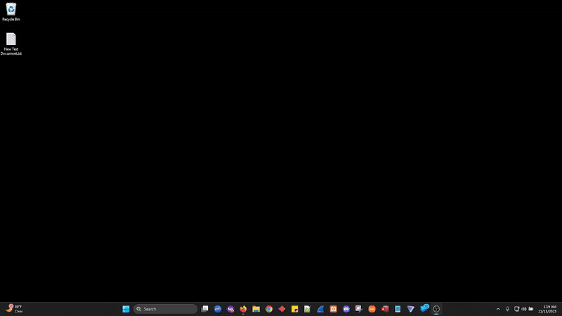

<!-- Project Logo -->
<p align="center">
  
</p>

<p align="center">
  <a href="#project-description">Project Description</a> •
  <a href="#key-features">Key Features</a> •
  <a href="#technology-stack">Tech Stack</a> •
</p>

<!-- Demo GIFs Side by Side -->
<p align="center">
  <table>
    <tr>
      <td align="center">
        
      </td>
      <td align="center">
        
      </td>
    </tr>
  </table>
</p>

## Project Description

**AcademicDB** is a structured academic information system designed to manage student, course, faculty, and institutional data using a hybrid architecture that combines the usability of **Microsoft Access** with the power and scalability of **MariaDB** (running through XAMPP).

The system uses **Access forms, queries, and reports** as the primary front-end interface while leveraging a **MariaDB/MySQL relational database** as the backend storage engine. This architecture provides the convenience of a desktop UI with the robustness of a full SQL server.

All database schema, tables, relationships, and stored procedures are authored and maintained using **hand-written MySQL scripts**, executed via the terminal using the `SOURCE` command. This ensures full control, transparency, and portability of the database logic.

AcademicDB is designed for educational institutions, researchers, and administrative offices that require a **local, secure, customizable academic data system** without relying on cloud infrastructure or proprietary SIS platforms.

---

## Key Components

### **1. Microsoft Access Frontend (Forms, Queries, Reports)**
The Access frontend serves as the primary user interface for interacting with the database.  
It provides a structured and user-friendly environment for entering, reviewing, and managing academic records.  
Key elements include:

- **Data Entry Forms:**  
  Organized interfaces for students, courses, faculty, subjects, grades, and enrollment data.

- **Navigation Panels / Switchboards:**  
  Allow quick access to key sections of the system.

- **Queries:**  
  Predefined and dynamic Access queries for filtering, searching, and summarizing academic data.

- **Reports:**  
  Printable academic reports (student lists, class schedules, course rosters, etc.).

- **ODBC Connectivity:**  
  Access communicates with MariaDB in real time through an ODBC DSN configuration.

---

### **2. MariaDB Relational Database (via XAMPP)**
MariaDB functions as the backend data engine, hosting all academic tables and enforcing data integrity.  
The XAMPP environment ensures local hosting, full control, and offline operation.

**Core functions include:**

- **Relational Data Storage:**  
  Well-organized tables for Students, Courses, Faculty, Subjects, Departments, Grade Levels, Enrollments, and supporting metadata.

- **Foreign Key Constraints:**  
  Ensures accurate relationships (e.g., students ↔ grades, courses ↔ departments).

- **Indexed Performance:**  
  Indexed fields make searches and joins efficient, even with large datasets.

- **ACID Compliance:**  
  Prevents data corruption and guarantees reliable transactions.

---

### **3. SQL Schema & Script Library**
All database structures are defined and maintained through a fully scripted SQL environment, written manually in Notepad++.

This includes:

- **Table Creation Scripts**  
- **Primary/Foreign Key Constraints**  
- **Insert Scripts for Lookup Tables**  
- **Views and Data Dictionaries**  
- **Stored Procedures / Triggers** (if implemented)  
- **Data Export and Verification Scripts**  

Scripts are executed via the MySQL terminal using commands like:
  mysql -u root -p
  SOURCE /path/to/schema.sql;
  SOURCE /path/to/insert_data.sql;
  SOURCE /path/to/select_all.sql;


This ensures the database is fully reproducible, version-controlled, and portable.

---

### **4. XAMPP Server Environment**
XAMPP provides the MariaDB server runtime and administrative tools.

**Key responsibilities:**

- Hosting MariaDB locally  
- Allowing command-line SQL access  
- Centralizing configuration files  
- Ensuring a fully offline, secure environment  
- Letting developers test and rebuild the database consistently  

XAMPP makes the system easy to deploy on any Windows machine without complex setup.

---

### **5. Real-Time Integration Layer (Access ↔ ODBC ↔ MariaDB)**
Communication between the frontend and backend occurs through an ODBC connection.

This layer provides:

- **Live database reads/writes**  
- **Automatic form updates when SQL data changes**  
- **User-friendly Access UI powered by real SQL queries**  
- **Secure, controlled data flow from Access to the database**  

This hybrid architecture combines a desktop-friendly interface with SQL-level stability and structure.

---

### **6. Documentation, Scripts, and Demo Assets**
The repository includes supporting materials such as:

- **GIFs and screen recordings** demonstrating terminal queries and Access form usage  
- **Schema scripts** for reproducing the database  
- **Notepad++ SQL development examples**  
- **Usage examples and test query outputs**  

These assets help users understand the system structure and how to deploy or modify it.

---

## Key Features

```javascript
const UserForm = () => {
  const [name, setName] = useState('');

  const handleSubmit = (e) => {
    e.preventDefault();
    alert(`Hello, ${name}`);
  };

  return (
    <form onSubmit={handleSubmit}>
      <input
        type="text"
        value={name}
        onChange={(e) => setName(e.target.value)}
        placeholder="Enter your name"
      />
      <button type="submit">Submit</button>
    </form>
  );
};

export default UserForm;

```

  
ToggleMessage

```javascript
const ToggleMessage = () => {
  const [isVisible, setIsVisible] = useState(false);

  return (
    
<div>
      <button onClick={() => setIsVisible(!isVisible)}>
        {isVisible ? 'Hide' : 'Show'} Message
      </button>
      {isVisible && 
<p>This is a toggled message!</p>
}
    </div>

  );
};

export default ToggleMessage;

```

## Key Features

This project replicates the core functionalities of YouTube, including:

*   **Video Streaming**: Users can upload and stream high-definition videos.
*   **User Authentication**: Secure sign-up/login using OAuth2.0.
*   **Video Recommendations**: A recommendation system that suggests relevant content based on user preferences.
*   **Cloud Integration**: Uploaded videos are stored in the cloud, with seamless playback across devices.

This project showcases a comprehensive technology stack involving full-stack web development and cloud services.

## Tech Stack

**Frontend**: React, Tailwind CSS, Redux  
**Backend**: Node.js, Express, MongoDB  
**Cloud & DevOps**: AWS (S3, CloudFront), Docker  
**Other**: OAuth2.0, WebSockets
